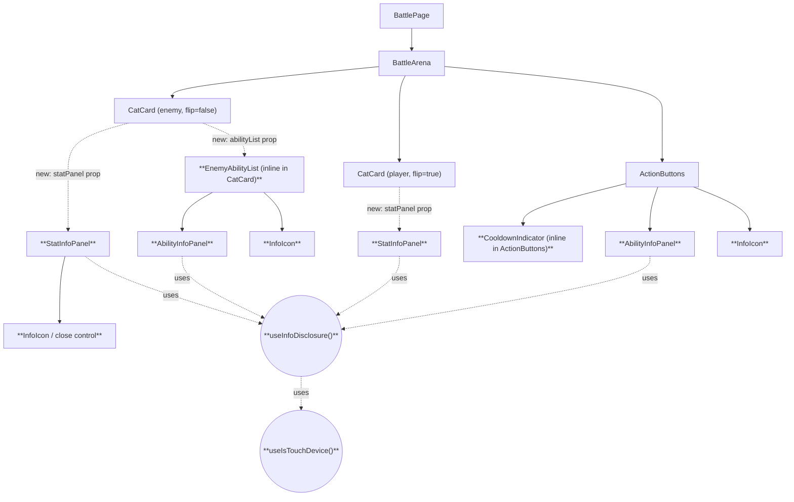

# Design Document

## Overview

This feature adds informational disclosure UI to the existing Battle screen: cooldown badges on player ability buttons, hover/tap/focus info panels for abilities and combat stats, and an enemy ability list. Every piece of displayed data already exists on `GameState`, `Enemy`, `EnemyAbility`, `Ability`, and `CatResponse` (`frontend/src/types/game.ts`); this is a pure frontend rendering feature layered on top of `BattlePage`, `BattleArena`, `ActionButtons`, and `CatCard`.

The central design problem is that five different acceptance-criteria groups (Requirements 2, 3, 4, 5, 6) all specify the *same* interaction contract — show on hover, hide on leave, show on keyboard focus, hide on blur, toggle on tap (touch devices), and (for the enemy stat panel only) an additional "pin" state. Rather than re-implement this five times, the design introduces one shared hook, `useInfoDisclosure`, that all five surfaces are built on top of. Requirement 5's Pinned mechanic is layered on as an optional capability of the same hook rather than a separate code path.

No backend changes are made. No field is added, removed, renamed, or retyped on `BattleStateResponse`, `BattleActionResponse`, `GameState`, `Enemy`, `EnemyAbility`, `Ability`, or `CatResponse` (Requirement 7). Existing component props are only ever **extended additively** — see "Prop Contract Changes" below for the two call sites where this happens and why it is non-breaking.

## Architecture

### Component Tree (additions in bold)



### New Modules

| File | Responsibility |
|---|---|
| `frontend/src/hooks/useInfoDisclosure.ts` | Shared hover/focus/touch/pin state machine + DOM event props for any info-panel trigger. |
| `frontend/src/hooks/useIsTouchDevice.ts` | Detects `Touch_Device` via `(hover: none)`. |
| `frontend/src/lib/battleInfo.ts` | Pure derivation functions: placeholder substitution, ability/stat field projections, cooldown lookups, enemy-ability-list projection. No React, no side effects — this is the module property-based tests target directly. |
| `frontend/src/components/AbilityInfoPanel.tsx` | Presentational panel rendering an ability's description/damage/effect(/lore). Used for both player abilities (Requirement 2) and enemy abilities (Requirement 4). |
| `frontend/src/components/StatInfoPanel.tsx` | Presentational panel rendering a creature's stat rows. Used for the player cat (Requirement 3) and the enemy (Requirement 5), the latter with an optional close control when Pinned. |
| `frontend/src/components/InfoIcon.tsx` | Small "ⓘ" tap target rendered only on Touch_Device, structurally a sibling of its associated trigger (never nested inside it) so a single tap can only land on one target. |

### Modified Components

| File | Change |
|---|---|
| `frontend/src/components/ActionButtons.tsx` | Each ability button gains a `CooldownIndicator` badge, a hover/focus-driven `AbilityInfoPanel`, and (touch only) an `InfoIcon` sibling. `Attack`/`Defend` are untouched — Requirements 1/2 only apply to abilities. |
| `frontend/src/components/CatCard.tsx` | Avatar becomes a focusable, hoverable trigger for a `StatInfoPanel` (new optional `statPanel` prop). When rendered for the enemy, also renders the `EnemyAbilityList` (new optional `abilityList` prop) and enables pinning (new optional `pinnable` prop). |
| `frontend/src/components/BattleArena.tsx` | Passes the new `statPanel`/`abilityList`/`pinnable` data through to each `CatCard` instance (additive prop widening only — see below). |
| `frontend/src/pages/BattlePage.tsx` | Builds the `statPanel`/`abilityList` field objects from `cat` and `gameState.enemy` via `lib/battleInfo.ts` and passes them into `BattleArena`. |

## Components and Interfaces

### `useInfoDisclosure`

This is the single reusable primitive backing Requirements 2, 3, 4, 5, and 6. It models exactly one state machine, reused by every trigger type in the feature.

```ts
// frontend/src/hooks/useInfoDisclosure.ts

export interface UseInfoDisclosureOptions {
  /** Enables the Pinned mechanic (Requirement 5). Default: false. */
  pinnable?: boolean;
  /** Grace window (ms) after a pointer leaves before the panel actually
   *  closes; a re-entry within the window cancels the close. Used only by
   *  the Enemy_Ability_List (Requirement 4.4/4.5). Default: 0. */
  hoverOutGraceMs?: number;
  /** When true, all triggers are no-ops (Requirement 2.9 — disabled ability
   *  buttons must not change visibility). Default: false. */
  disabled?: boolean;
}

export interface UseInfoDisclosureResult {
  /** True iff the panel should be visible right now. */
  isOpen: boolean;
  /** True iff the panel is in the Pinned state (Requirement 5). */
  isPinned: boolean;
  /** Spread onto the trigger element (button/avatar/list entry). */
  triggerProps: {
    onMouseEnter: () => void;
    onMouseLeave: () => void;
    onFocus: () => void;
    onBlur: () => void;
    onKeyDown: (e: React.KeyboardEvent) => void; // Enter/Space -> pin, when pinnable
    "aria-describedby": string | undefined; // only set once panelId is known & open
  };
  /** Call from an Info_Icon or a touch-tap on the trigger itself. */
  toggleTouch: () => void;
  /** Call from the Pinned panel's close control. */
  unpinAndClose: () => void;
  /** Stable id to assign to the panel element and reference via
   *  `aria-describedby` (Requirement 6.3). */
  panelId: string;
}

export function useInfoDisclosure(
  options?: UseInfoDisclosureOptions,
): UseInfoDisclosureResult;
```

Internally, the hook is a small reducer over four booleans, with `isOpen` **always** computed as their disjunction — this single line of logic is the entire shared contract that Requirements 2.1/2.2, 3.1/3.2, 4.3, 5.1/5.2, and 6.1/6.2 all reduce to:

```ts
type DisclosureState = {
  hovering: boolean;
  focused: boolean;
  touchOpen: boolean;
  pinned: boolean;
};

function isOpen(s: DisclosureState): boolean {
  return s.pinned || s.hovering || s.focused || s.touchOpen;
}

type Action =
  | { type: "HOVER_ENTER" }
  | { type: "HOVER_LEAVE_CONFIRMED" } // dispatched immediately, or after the grace timer
  | { type: "FOCUS_IN" }
  | { type: "FOCUS_OUT" }
  | { type: "TOUCH_TOGGLE" }
  | { type: "PIN" }
  | { type: "UNPIN_AND_CLOSE" };

function reduce(s: DisclosureState, a: Action): DisclosureState {
  switch (a.type) {
    case "HOVER_ENTER": return { ...s, hovering: true };
    case "HOVER_LEAVE_CONFIRMED": return { ...s, hovering: false };
    case "FOCUS_IN": return { ...s, focused: true };
    case "FOCUS_OUT": return { ...s, focused: false };
    case "TOUCH_TOGGLE": return { ...s, touchOpen: !s.touchOpen };
    case "PIN": return { ...s, pinned: true };
    case "UNPIN_AND_CLOSE": return { pinned: false, hovering: false, focused: false, touchOpen: false };
  }
}
```

`disabled: true` short-circuits `triggerProps` to no-op handlers and `toggleTouch`/pin dispatch to no-ops, satisfying Requirement 2.9 without a separate code path.

`hoverOutGraceMs` (Requirement 4.4–4.6) wraps `HOVER_LEAVE_CONFIRMED` in a `setTimeout`; `HOVER_ENTER` clears any pending timeout before setting `hovering: true`, so a re-entry inside the window never dispatches the leave action at all — the panel is never observed closed during a sub-window gap.

Pin wiring per component:
- **Enemy avatar click while open, not Touch_Device** (5.3) → dispatch `PIN`.
- **Enemy avatar `Enter`/`Space` while open and focused, not Touch_Device** (5.4/6.4) → same `PIN` dispatch, from `triggerProps.onKeyDown`.
- **Close control click/tap** (5.6) → dispatch `UNPIN_AND_CLOSE`.
- `pinnable` defaults to `false` for every trigger except the enemy `StatInfoPanel`'s trigger, so `AbilityInfoPanel` triggers and the player `StatInfoPanel` trigger never expose pin affordances — they simply never call `PIN`/`unpinAndClose`.

### `useIsTouchDevice`

```ts
// frontend/src/hooks/useIsTouchDevice.ts
import { useMediaQuery } from "@base-ui/react/unstable-use-media-query";

export function useIsTouchDevice(): boolean {
  return useMediaQuery("(hover: none)", { defaultMatches: false, noSsr: true });
}
```

This directly matches the Glossary's definition of `Touch_Device` ("a client whose primary pointer input does not support hover... `(hover: none)`"). `@base-ui/react` is already a project dependency (used by `ui/button.tsx`, `ui/input.tsx`); no new package is introduced. Consumers use this boolean to decide whether to render an `InfoIcon` (Requirements 2.3, 4.7) and whether tap-to-toggle vs. click-to-pin semantics apply (Requirements 3.3/4.8/5.3/5.7 vs. 5.3/5.4).

### `lib/battleInfo.ts` — pure derivations

All content-sourcing and exclusion rules (Requirements 2.6–2.8, 3.4–3.5, 4.1–4.2, 5.8–5.9, and the cooldown rules of Requirement 1) live here as plain functions with no React dependency, so they can be property-tested directly without rendering.

```ts
export const PLACEHOLDER_TEXT = "No information available.";
export const NO_EFFECT_TEXT = "No effect.";

/** Requirement 2.7 / 3.5: missing or empty-string fields get placeholder text. */
export function withPlaceholder(value: string | null | undefined): string {
  return value == null || value === "" ? PLACEHOLDER_TEXT : value;
}

/** Requirement 2.8: null effect is a valid, distinct "no effect" state. */
export function formatEffect(effect: Effect | null): string {
  return effect === null ? NO_EFFECT_TEXT : effect;
}

export interface AbilityInfoFields {
  description: string;
  dmg: number;
  effect: string;
  lore?: string; // present only for player abilities (Ability has lore; EnemyAbility does not)
}

/** Requirement 2.6/2.7/2.8: player Ability_Info_Panel content. */
export function getAbilityInfoFields(ability: Ability): AbilityInfoFields {
  return {
    description: withPlaceholder(ability.description),
    dmg: ability.dmg,
    effect: formatEffect(ability.effect),
    lore: withPlaceholder(ability.lore),
  };
}

/** Requirement 4.3: enemy Ability_Info_Panel content (no lore field exists on EnemyAbility). */
export function getEnemyAbilityInfoFields(ability: EnemyAbility): AbilityInfoFields {
  return {
    description: withPlaceholder(ability.description),
    dmg: ability.dmg,
    effect: formatEffect(ability.effect),
  };
}

export interface PlayerStatFields {
  dmg: number; defence: number; spd: number;
  maxHp: number; maxMana: number; breed: string; lore: string;
}

/** Requirement 3.1/3.4/3.5: player Stat_Info_Panel content, sourced from CatResponse. */
export function getPlayerStatFields(cat: Cat): PlayerStatFields {
  return {
    dmg: cat.dmg, defence: cat.defence, spd: cat.spd,
    maxHp: cat.max_hp, maxMana: cat.max_mana,
    breed: withPlaceholder(cat.breed), lore: withPlaceholder(cat.lore),
  };
}

export interface EnemyStatFields {
  breed: string; atk: number; defence: number; spd: number;
  maxHp: number; maxMana: number;
}

/** Requirement 5.1/5.8/5.9: enemy Stat_Info_Panel content — EXACTLY these six
 *  fields; ability_cooldowns is never read here. */
export function getEnemyStatFields(enemy: Enemy): EnemyStatFields {
  return {
    breed: enemy.breed, atk: enemy.atk, defence: enemy.defence,
    spd: enemy.spd, maxHp: enemy.max_hp, maxMana: enemy.max_mana,
  };
}

export interface EnemyAbilityListEntry { id: string; name: string; }

/** Requirement 4.1/4.2: Enemy_Ability_List entries — id+name only, never a
 *  cooldown value, in the same order as Enemy.abilities. */
export function toEnemyAbilityList(enemy: Enemy): EnemyAbilityListEntry[] {
  return enemy.abilities.map((a) => ({ id: a.id, name: a.name }));
}

/** Requirement 1.1/1.2: cooldown lookup treats a missing key as 0. */
export function getRemainingCooldown(
  cooldowns: Record<string, number>,
  abilityId: string,
): number {
  return cooldowns[abilityId] ?? 0;
}

/** Requirement 1.3/1.4: the single predicate gating ability-button activation. */
export function canUseAbility(
  remainingCooldown: number,
  mana: number,
  manaCost: number,
  canAct: boolean,
): boolean {
  return remainingCooldown === 0 && mana >= manaCost && canAct;
}
```

### `AbilityInfoPanel`

```ts
interface AbilityInfoPanelProps {
  id: string;                 // == useInfoDisclosure().panelId
  name?: string;               // shown for enemy abilities (Req 4.3); optional for player (button already shows the name)
  fields: AbilityInfoFields;
  className?: string;
}
```

Renders a small `role="tooltip"` panel (`id={id}`) listing description, damage, effect, and lore when present. Purely presentational — takes already-derived `AbilityInfoFields`, never touches raw `Ability`/`EnemyAbility` objects itself, so the same component serves both Requirement 2 and Requirement 4.

### `StatInfoPanel`

```ts
interface StatInfoPanelProps {
  id: string;
  title: string; // e.g. cat name or enemy name
  rows: Array<{ label: string; value: string | number }>;
  isPinned?: boolean;
  onClose?: () => void; // rendered as a close control iff isPinned
  className?: string;
}
```

`BattleArena`/`CatCard` build `rows` from `PlayerStatFields` or `EnemyStatFields` (label ordering per the requirement's field lists: damage, defence, speed, max HP, max mana, breed, lore for the player; breed, attack, defence, speed, max HP, max mana for the enemy). The close control (Requirement 5.10) is only rendered when `isPinned` is true, satisfying "render a close control on every Pinned Stat_Info_Panel" without ever rendering one on non-pinnable panels.

### `InfoIcon`

```ts
interface InfoIconProps {
  onToggle: () => void; // calls useInfoDisclosure().toggleTouch
  "aria-controls": string;
  label: string; // accessible name, e.g. "Toggle info for Pounce"
}
```

Rendered only when `useIsTouchDevice()` is true, and always as a **sibling** of its associated trigger element (never nested inside a `<button>`), so Requirement 2.5's "a tap can register on the button or the icon, and if it registers on both, do both" is satisfied structurally: in this layout a single tap event can only ever land on one DOM element, so the "registers on both" branch reduces to "the icon sits within the button's bounding box but is its own hit target" — verified with an interaction test, not a new state machine.

### `ActionButtons` (modified)

Layout per ability becomes:

```tsx
<div className="relative">
  <Button onClick={() => onUseAbility(ability.id)} disabled={!canUse}>
    {/* name, mana cost, CooldownIndicator badge (Requirement 1.6: separate element, distinct icon/position from the "MP" label) */}
  </Button>
  {isTouchDevice && (
    <InfoIcon
      onToggle={disclosure.toggleTouch}
      aria-controls={disclosure.panelId}
      label={`Toggle info for ${ability.name}`}
    />
  )}
  {disclosure.isOpen && (
    <AbilityInfoPanel id={disclosure.panelId} fields={getAbilityInfoFields(ability)} />
  )}
</div>
```

`triggerProps` (hover/focus handlers, `aria-describedby`) are spread onto the outer `<Button>` itself so hovering/focusing the ability button opens its panel, per Requirement 2.1/2.2/6.1/6.2. `useInfoDisclosure({ disabled: !canUse })` is created per-ability, so Requirement 2.9 is enforced per-button without extra branching in `ActionButtons`.

### `CatCard` (modified)

```ts
interface CatCardProps {
  // ...existing fields unchanged...
  statPanel?: PlayerStatFields | EnemyStatFields; // NEW, optional
  statPanelTitle?: string;                         // NEW, optional — defaults to `name`
  abilityList?: EnemyAbilityListEntry[];           // NEW, optional — enemy only
  abilityFieldsById?: Record<string, AbilityInfoFields>; // NEW, optional — enemy only
  pinnable?: boolean;                              // NEW, optional, default false — enemy only
}
```

When `statPanel` is provided, the avatar `<div>` gains `tabIndex={0}`, `role="button"`, an accessible name, and the `useInfoDisclosure({ pinnable })` `triggerProps`; the `StatInfoPanel` renders beside it when open. When `abilityList` is provided (enemy card only), an inline list of ability names renders below the stat row, each entry independently wrapped with its own `useInfoDisclosure({ hoverOutGraceMs: 150 })` (Requirement 4.4–4.6) and its own `AbilityInfoPanel` sourced from `abilityFieldsById[entry.id]`.

### Prop Contract Changes (explicit, additive only)

Per the constraint against breaking existing prop contracts, the following two changes are **additions of new optional props** to component interfaces that are only consumed within this codebase by `BattlePage`/`BattleArena`/`ActionButtons` themselves (no other page imports these components with positional/spread props that would be affected):

1. `CatCardProps` gains `statPanel`, `statPanelTitle`, `abilityList`, `abilityFieldsById`, `pinnable` — all optional, all defaulting to "feature off," so `MemorialCatCard`'s sibling usage pattern and any other future caller of `CatCard` without these props is unaffected. `CatCard.test.tsx`'s existing assertions (emoji fallback / `` rendering) remain valid unchanged.
2. `ActionButtonsProps` is unchanged — cooldown/info-panel data is derived internally from the existing `abilities`/`cooldowns`/`mana` props, so no new prop is needed there.

No existing prop is removed, renamed, or retyped.

## Data Models

No new types are added to `frontend/src/types/game.ts` and no backend schema changes are made (Requirement 7). The design introduces only **derived, panel-local** TypeScript interfaces in `lib/battleInfo.ts` (`AbilityInfoFields`, `PlayerStatFields`, `EnemyStatFields`, `EnemyAbilityListEntry`) that are pure projections of existing types.

### Field mapping (exact, per acceptance criteria)

| Panel | Source type | Fields used | Fields explicitly excluded |
|---|---|---|---|
| Cooldown_Indicator | `GameState.player_ability_cooldowns` + `Ability.id` | remaining turns (lookup, 0 if absent) | — |
| Ability_Info_Panel (player) | `CatResponse.abilities[]` (`Ability`) | `description`, `dmg`, `effect`, `lore` | `cooldown`, `mana_cost`, `is_special`, `type`, `creature_id`, `id`, `name` (name shown by the button itself, not duplicated in the panel) |
| Ability_Info_Panel (enemy) | `Enemy.abilities[]` (`EnemyAbility`) | `name`, `description`, `dmg`, `effect` | `Enemy.ability_cooldowns`, `mana_cost`, `is_special`, `type`, `id`, `cooldown` |
| Stat_Info_Panel (player) | `CatResponse` (`Cat`/`Creature`) | `dmg`, `defence`, `spd`, `max_hp`, `max_mana`, `breed`, `lore` | `current_hp`, `mana`, `abilities`, `avatar_url`, `lives_remaining`, `class`, `id`, all `Cat`-only fields (`user_id`, `wins`, etc.) |
| Stat_Info_Panel (enemy) | `GameState.enemy` (`Enemy`) | `breed`, `atk`, `defence`, `spd`, `max_hp`, `max_mana` | `hp`, `mana`, `shield`, `abilities`, `ability_cooldowns`, `avatar_url`, `name` |
| Enemy_Ability_List | `Enemy.abilities[]` (`EnemyAbility`) | `id`, `name` | `Enemy.ability_cooldowns`, `dmg`, `mana_cost`, `cooldown`, `effect`, `description`, `is_special`, `type` |

This table is the direct implementation of Requirement 7.1 ("derive all content exclusively from fields already present") and is what the content-derivation correctness properties below check mechanically.

## Correctness Properties

*A property is a characteristic or behavior that should hold true across all valid executions of a system-essentially, a formal statement about what the system should do. Properties serve as the bridge between human-readable specifications and machine-verifiable correctness guarantees.*

The prework analysis identified that Requirements 2, 3, 4, 5, and 6 largely reduce to one shared disclosure state machine, and that the placeholder/no-effect and cooldown-exclusion rules generalize across multiple fields/panels. The properties below reflect that consolidation — each validates a distinct pure function or invariant, with no property implied in full by another.

### Property 1: Cooldown indicator visibility matches remaining cooldown

*For any* cooldown map (`Record<string, number>`) and *any* ability id, a Cooldown_Indicator is shown for that ability if and only if `getRemainingCooldown(cooldowns, abilityId) > 0`, and when shown its displayed number equals that remaining value exactly.

**Validates: Requirements 1.1, 1.2, 1.5**

### Property 2: Ability usability is exactly the conjunction of its gating conditions

*For any* remaining cooldown, mana amount, mana cost, and turn-phase flag, `canUseAbility(remaining, mana, cost, canAct)` is `true` if and only if `remaining === 0 AND mana >= cost AND canAct` — in particular it is always `false` whenever `remaining > 0`, regardless of the other two inputs.

**Validates: Requirements 1.3, 1.4**

### Property 3: Disclosure visibility is exactly hovering-or-focused-or-touchOpen-or-pinned

*For any* sequence of `useInfoDisclosure` actions (`HOVER_ENTER`, `HOVER_LEAVE_CONFIRMED`, `FOCUS_IN`, `FOCUS_OUT`, `TOUCH_TOGGLE`, `PIN`, `UNPIN_AND_CLOSE`) applied from the initial closed state, `isOpen` after each action equals `pinned || hovering || focused || touchOpen` computed from that action's cumulative effect on the four flags. In particular, once `pinned` is `true`, `isOpen` remains `true` regardless of any subsequent `HOVER_LEAVE_CONFIRMED` or `FOCUS_OUT`.

**Validates: Requirements 2.1, 2.2, 3.1, 3.2, 3.3, 4.3, 5.1, 5.2, 5.5, 5.7, 6.1, 6.2**

### Property 4: Touch toggle is self-inverse

*For any* starting `touchOpen` value, dispatching `TOUCH_TOGGLE` twice in a row with no other action in between returns `touchOpen` to its original value, and dispatching it once always flips it.

**Validates: Requirements 2.4, 3.3, 4.8, 5.7**

### Property 5: Hover-out grace window

*For any* leave-then-reenter gap duration, if the gap is strictly less than the configured `hoverOutGraceMs`, the panel is never observed in a closed state at any point during the gap; if the gap is greater than or equal to `hoverOutGraceMs`, the panel closes and a subsequent re-entry opens it again as a fresh hover.

**Validates: Requirements 4.4, 4.5, 4.6**

### Property 6: Player ability info content is a faithful, placeholder-safe projection

*For any* `Ability` object, `getAbilityInfoFields(ability)` returns `dmg` equal to `ability.dmg`; `description` equal to `ability.description` unless it is `null`/`undefined`/`""`, in which case it equals `PLACEHOLDER_TEXT`; `lore` following the same placeholder rule for `ability.lore`; and `effect` equal to `NO_EFFECT_TEXT` if `ability.effect === null`, otherwise equal to `ability.effect` — with `NO_EFFECT_TEXT !== PLACEHOLDER_TEXT` always.

**Validates: Requirements 2.6, 2.7, 2.8**

### Property 7: Enemy ability info content is a faithful, placeholder-safe projection

*For any* `EnemyAbility` object, `getEnemyAbilityInfoFields(ability)` returns `dmg` equal to `ability.dmg`; `description` following the same placeholder rule as Property 6; `effect` following the same no-effect rule as Property 6; and the result never contains a `lore` field.

**Validates: Requirements 4.3**

### Property 8: Player stat panel content is a faithful, placeholder-safe projection

*For any* `Cat` object, `getPlayerStatFields(cat)` returns `dmg`, `defence`, `spd`, `maxHp` (`cat.max_hp`), and `maxMana` (`cat.max_mana`) equal to the corresponding `cat` fields exactly, and `breed`/`lore` equal to the corresponding `cat` field unless missing/empty, in which case `PLACEHOLDER_TEXT`.

**Validates: Requirements 3.4, 3.5**

### Property 9: Enemy stat panel content excludes cooldowns and contains exactly six fields

*For any* `Enemy` object (including one whose `ability_cooldowns` values are chosen adversarially to coincide with other numeric fields), `getEnemyStatFields(enemy)` has exactly the keys `breed`, `atk`, `defence`, `spd`, `maxHp`, `maxMana`; each value equals the corresponding `Enemy` field exactly; and no value in the result is ever sourced from `enemy.ability_cooldowns`.

**Validates: Requirements 5.1, 5.8, 5.9**

### Property 10: Enemy ability list entries preserve order and identity, and never leak a cooldown

*For any* `Enemy` object, `toEnemyAbilityList(enemy)` has the same length and order as `enemy.abilities`, each entry's `name` equals the corresponding `enemy.abilities[i].name`, each entry has exactly the keys `id` and `name`, and no entry's values ever equal a value drawn from `enemy.ability_cooldowns` for a different, coincidental reason (i.e., the projection function never reads `ability_cooldowns` at all).

**Validates: Requirements 4.1, 4.2**

### Property 11: A disabled disclosure is a total no-op

*For any* `useInfoDisclosure({ disabled: true })` instance and *any* sequence of trigger actions (hover, focus, touch-toggle, pin attempt), `isOpen` remains `false` and `isPinned` remains `false` throughout, and no ability-submission callback is invoked as a side effect of those actions.

**Validates: Requirements 2.9**

### Property 12: Pinning always opens and marks pinned, from any reachable state

*For any* reachable `DisclosureState`, dispatching `PIN` results in a state with `pinned === true`, and therefore `isOpen === true` per Property 3, regardless of the prior values of `hovering`, `focused`, and `touchOpen`.

**Validates: Requirements 5.3, 5.4, 6.4**

### Property 13: Unpin-and-close always fully resets, from any reachable state

*For any* reachable `DisclosureState`, dispatching `UNPIN_AND_CLOSE` results in `pinned === false`, `hovering === false`, `focused === false`, `touchOpen === false`, and therefore `isOpen === false`.

**Validates: Requirements 5.6**

## Error Handling

This feature has no network calls, no new failure modes, and no user-correctable errors of its own — it only renders data already validated and typed by the existing Battle API integration. Error handling is limited to defensive rendering of already-possible data shapes:

- **Missing/empty `description`, `lore`, `breed`** (Requirements 2.7, 3.5): handled by `withPlaceholder` rendering fixed placeholder text rather than an empty panel section. No exception is thrown; `null`, `undefined`, and `""` are all treated identically.
- **`effect === null`** (Requirement 2.8): handled explicitly as a distinct valid state (`formatEffect`), not conflated with the missing-field case.
- **Empty `Enemy.abilities` array**: `toEnemyAbilityList` returns `[]`; the `Enemy_Ability_List` renders no entries and no info panels, with no ambient error state (an enemy with a currently-empty ability list is a valid backend state, not an error).
- **Rapid state changes mid-interaction** (e.g., a battle action response arrives while a panel is open): panels are keyed off derived data (ability id, enemy identity) recomputed on every render, so a new `player_ability_cooldowns` value is reflected immediately (Requirement 1.5) without any special-cased reconciliation logic; if an ability disappears entirely between renders (not expected given current API behavior, but defensively) its `AbilityInfoPanel` simply unmounts along with its trigger.
- **Non-Touch_Device vs. Touch_Device ambiguity** (a device that changes hover capability, e.g. a hybrid laptop/tablet mid-session): `useIsTouchDevice` is a live media-query subscription, so the UI re-evaluates on change rather than caching a stale value; no error state is needed because both branches are always valid UI.

## Testing Strategy

### Dual Testing Approach

- **Unit/component tests** (React Testing Library, matching the existing patterns in `BattlePage.test.tsx` and `CatCard.test.tsx`) cover fixed-branch rendering rules, event wiring, and interaction scenarios: Touch_Device conditional rendering (Requirements 2.3, 4.7), the icon-vs-button tap separation (Requirement 2.5), the close-control presence on Pinned panels (Requirement 5.10), the Enter/Space-to-pin keyboard wiring (Requirements 5.4, 6.4), and `aria-describedby` wiring per concrete surface (Requirement 6.3).
- **Property-based tests** (`fast-check`, added as a new dev dependency since the project has no existing PBT library — Vitest is already in place as the runner) cover the thirteen correctness properties above against the pure functions in `lib/battleInfo.ts` and the `useInfoDisclosure` reducer in isolation (exported for testing as a standalone `reduce`/`isOpen` pair, decoupled from React state so it can be exercised directly with generated action sequences).

### Property Test Configuration

- Each property test runs a minimum of 100 iterations (`fc.assert(fc.property(...), { numRuns: 100 })` or higher where fast-check's default already exceeds this).
- Each test is tagged with a comment referencing its design property, in the required format, e.g.:
  ```ts
  // Feature: battle-info-tooltips, Property 1: Cooldown indicator visibility matches remaining cooldown
  ```
- Generators:
  - Cooldown maps: `fc.dictionary(fc.string(), fc.integer({ min: 0, max: 20 }))` plus a separately generated ability id, including ids both present and absent from the map.
  - `Ability`/`EnemyAbility`: record generators covering `description`/`lore` as `fc.oneof(fc.constant(null), fc.constant(undefined), fc.constant(""), fc.string())` to exercise the placeholder boundary, and `effect` as `fc.oneof(fc.constant(null), fc.constantFrom(...EffectValues))`.
  - `Cat`/`Enemy` stat objects: numeric fields via `fc.integer()`/`fc.nat()`, string fields via the same placeholder-boundary generator above.
  - Disclosure action sequences: `fc.array(fc.constantFrom("HOVER_ENTER", "HOVER_LEAVE_CONFIRMED", "FOCUS_IN", "FOCUS_OUT", "TOUCH_TOGGLE", "PIN", "UNPIN_AND_CLOSE"))`, replayed through `reduce` while checking the `isOpen` invariant after every step (Property 3) — this is the standard "model the reducer, check an invariant after every transition" pattern for state-machine properties.
  - Hover-out timing (Property 5): fake timers (`vi.useFakeTimers()`) with a generated gap in `[0, 300]` ms compared against the fixed `150` ms grace window.

### Unit Testing Balance

Component tests stay focused on wiring and fixed-branch behavior (does the icon render on touch, does clicking the close control call the right handler, does the panel's `id` match the trigger's `aria-describedby`) — the input-space-heavy correctness (placeholder substitution across arbitrary strings, cooldown lookups across arbitrary maps, the disclosure state machine across arbitrary action sequences) is delegated to the property tests above rather than enumerated as dozens of unit-test cases.
