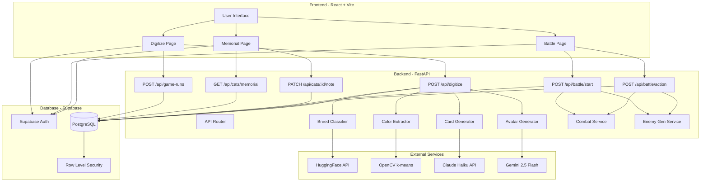
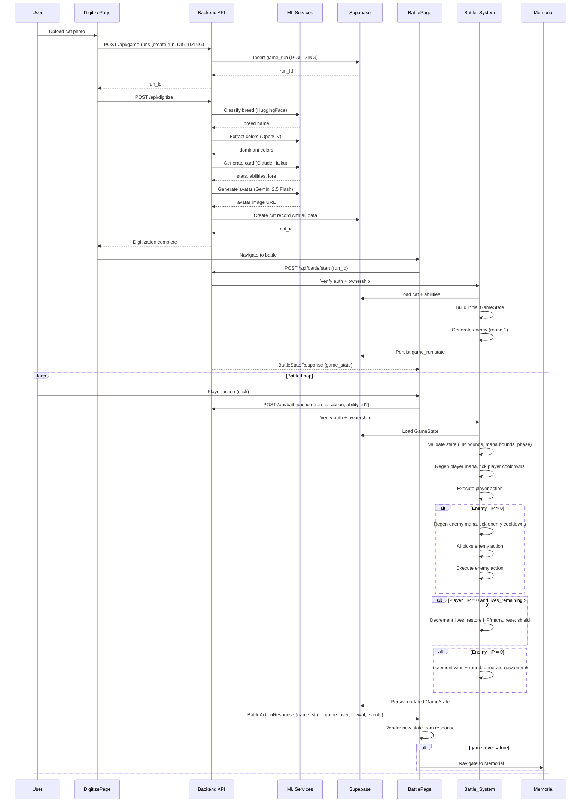

# Design Document: Nine Lives Complete Implementation

## Overview

Nine Lives is a cat digitization roguelike game where users upload cat photos that are transformed into playable characters through ML/AI processing. The game features turn-based combat with a 9-lives system, culminating in a memorial for fallen cats. This design covers the complete implementation of: (1) Cat Digitization Pipeline using HuggingFace, OpenCV, Claude Haiku, and Gemini 2.5 Flash, (2) Supabase database integration with RLS policies, (3) Battle system with abilities, mana, cooldowns, and enemy AI, (4) Memorial system for fallen cats, and (5) Complete game flow integration.

**Architecture principle:** The backend is the sole owner of all data access. Beyond being the authoritative game engine (all combat calculations, enemy generation, state mutations, and persistence happen exclusively on the backend), the backend also mediates **every** database read and write. The frontend never reads from or writes to the database directly. It uses the Supabase client solely for authentication — login, session management, and obtaining the JWT — and calls authenticated backend HTTP endpoints for all data operations (memorial cats, personal notes, game_run creation, battle state). The frontend is a rendering and input layer: it submits player actions and data requests via authenticated backend endpoints and renders the data returned in the response. It has no direct database access and performs no combat math.

**Current State:** Design docs complete, frontend battle loop partially working with mock data, backend skeleton exists with empty service files.

**Tech Stack:** React + Vite + TypeScript + Tailwind CSS + framer-motion (frontend), Python FastAPI (backend), Supabase (database + auth), HuggingFace API (breed classification), OpenCV (color extraction), Claude Haiku API (card generation), Gemini 2.5 Flash (avatar generation).

## Architecture






## Components and Interfaces

### Frontend Components

#### 1. DigitizePage

**Purpose**: Handles cat photo upload and digitization flow

**Interface**:

```typescript
interface DigitizePageState {
  status: 'idle' | 'uploading' | 'processing' | 'complete' | 'error';
  uploadedFile: File | null;
  errorMessage: string | null;
  catId: string | null;
}
```

**Responsibilities**:

- Accept cat photo file upload
- Create game_run with status DIGITIZING by calling the backend `POST /api/game-runs` endpoint (with auth token) — **not** via a direct Supabase insert
- Call backend /api/digitize endpoint
- Display processing status to user
- Navigate to BattlePage on completion

**Note**: DigitizePage uses the Supabase client only to obtain the auth token/session. All database writes (game_run creation) go through authenticated backend endpoints.

#### 2. BattlePage

**Purpose**: Main turn-based combat interface — renders state returned by the Battle API

**Responsibilities**:

- Read `runId` from route params
- Call `startBattle(runId)` on mount via `useGameState`
- Pass action handlers to child components (`submitAction`)
- Render `gameState` returned from the Battle API
- Display `events` list as a turn log
- Show revival notification when `revival` flag is true
- Navigate to MemorialPage when `game_over` flag is true
- Display loading/error states

**Note**: BattlePage performs no combat calculations. It is a pure rendering layer that presents whatever state the Battle API returns.

#### 3. MemorialPage

**Purpose**: Display all fallen cats

**Interface**:

```typescript
interface MemorialPageState {
  cats: Cat[];
  loading: boolean;
  error: string | null;
}
```

**Responsibilities**:

- Load all user's cats with status MEMORIAL via the backend `GET /api/cats/memorial` endpoint (with auth token) — **not** via a direct Supabase query
- Display cat cards with stats, lore, death date
- Allow user to add/edit personal notes by calling the backend `PATCH /api/cats/{cat_id}/note` endpoint — **not** via a direct Supabase update
- Show lifetime wins/rounds survived

**Note**: MemorialPage uses the Supabase client only for the auth token/session. All memorial reads and note updates go through authenticated backend endpoints.

#### 4. useGameState Hook

**Purpose**: Thin API wrapper — manages local UI state and calls the Battle API. Contains no combat math.

**Interface**:

```typescript
interface UseGameStateReturn {
  gameState: GameState | null;
  cat: Cat | null;
  isLoading: boolean;
  error: string | null;
  revival: boolean;
  events: string[];
  startBattle: (runId: string) => Promise<void>;
  submitAction: (action: "attack" | "defend" | "ability", abilityId?: string) => Promise<void>;
}

function useGameState(): UseGameStateReturn
```

**Responsibilities**:

- `startBattle(runId)`: calls `POST /api/battle/start`, sets local `gameState` and `cat` from response
- `submitAction(action, abilityId?)`: calls `POST /api/battle/action`, sets local `gameState`, `cat`, `revival`, and `events` from response
- Exposes `isLoading` and `error` for the UI to display
- No local combat calculations — all game outcomes come from the API response

**Note**: `cat` is the player's cat returned in the battle responses (static data — name, class, stats, avatar, abilities). BattlePage and ActionButtons render the player's name, class, and ability list from this `cat`, while per-ability cooldown values come from `gameState.player_ability_cooldowns` (keyed by ability id).

**Removed (compared to old implementation)**:

- All combat math (`attack`, `defend`, `useAbility`, `resolveEnemyTurn`, `initRound`)
- Direct Supabase writes
- Imports of `combat.ts` and `enemyGen.ts`

#### 4b. useMemorial Hook

**Purpose**: Loads memorial cats and updates personal notes via the backend API. Contains no direct Supabase database access.

**Interface**:

```typescript
interface UseMemorialReturn {
  cats: Cat[];
  loading: boolean;
  error: string | null;
  updateNote: (catId: string, note: string) => Promise<void>;
}

function useMemorial(): UseMemorialReturn
```

**Responsibilities**:

- On mount: fetch the authenticated user's MEMORIAL cats via `GET /api/cats/memorial` (with auth token) — **not** via a direct `supabase.from("cat").select(...)` query
- `updateNote(catId, note)`: validate ≤500 chars client-side, then call `PATCH /api/cats/{cat_id}/note` (with auth token) — **not** via a direct Supabase update
- Expose `loading` and `error` for the UI

**Changed (compared to old implementation)**:

- Replaces the direct Supabase `cat` table query with a call to `GET /api/cats/memorial`
- Replaces the direct Supabase note update with a call to `PATCH /api/cats/{cat_id}/note`
- The Supabase client is used only for obtaining the auth token/session

**Note**: The `useGameState` hook already routes all data access through the Battle API and is unchanged by this decision. The frontend Supabase client is **auth-only** across the whole app — it is never used for direct database reads or writes.

### Deleted Frontend Files

**`frontend/src/utils/combat.ts` — DELETED**
All combat logic (damage formulas, mana regen, cooldown ticking, enemy AI) has moved to `backend/services/combat.py`. This file is removed.

**`frontend/src/utils/enemyGen.ts` — DELETED**
All enemy generation logic (ability pool, stat scaling, enemy construction) has moved to `backend/services/enemy_gen.py`. This file is removed.

### Backend Components

#### 5. Battle Router (`routers/battle.py`)

**Purpose**: Expose the Battle API — authenticates requests, loads/persists state, delegates combat to the Combat Service.

**Interface**:

```python
@router.post("/api/battle/start")
async def start_battle(run_id: str, user: AuthUser) -> BattleStateResponse

@router.post("/api/battle/action")
async def submit_action(body: BattleActionRequest, user: AuthUser) -> BattleActionResponse
```

**`submit_action` processing order**:

1. Verify auth token and confirm the authenticated user owns `run_id` (`game_run.user_id == authenticated user`)
2. Reject with 409 if `game_run.status == COMPLETED`
3. Load current `GameState` from `game_run.state`
4. Validate state invariants (HP bounds, mana bounds, phase must be PLAYER_TURN)
5. Regen player mana, tick player cooldowns
6. Execute player action (attack / defend / ability)
7. If enemy HP > 0: regen enemy mana, tick enemy cooldowns, AI picks and executes enemy action
8. Resolve death/revival if player HP = 0
9. If enemy HP = 0: increment wins counter, increment round, generate new enemy, skip enemy turn
10. Persist updated `GameState` (minus the transient `events`) to `game_run.state` — the loaded `cat` is **not** persisted into `game_run.state`
11. Return `BattleActionResponse{ game_state, cat, game_over, revival, events }` (the router already loaded the cat while resolving the action, so it is simply returned)

**`start_battle` processing order**:

1. Verify auth token and confirm the authenticated user owns `run_id` (`game_run.user_id == authenticated user`)
2. If `game_run.state` is already populated, return it directly (idempotent)
3. Load cat and abilities from database
4. Build initial `GameState`: player HP/mana from cat stats, round 1, phase PLAYER_TURN, special ability cooldowns pre-set to max
5. Generate enemy for round 1 via `enemy_gen.generate_enemy(1)`
6. Persist `GameState` to `game_run.state`, set `game_run.status = IN_PROGRESS` — the loaded `cat` is **not** persisted into `game_run.state`
7. Return `BattleStateResponse{ game_state, cat }` (the router already loaded the cat in step 3, so it is simply returned)


#### 5b. Data Router (`routers/data.py`)

**Purpose**: Mediate all non-battle, non-digitize database access for the frontend. These endpoints replace what were previously direct Supabase reads/writes from frontend pages and hooks. Every endpoint requires a valid Supabase JWT in the `Authorization` header, verifies the token, and enforces ownership against the authenticated user — consistent with the Battle API auth approach. The backend uses the Supabase service key for the actual queries.

**Interface**:

```python
@router.post("/api/game-runs")
async def create_game_run(user: AuthUser) -> CreateGameRunResponse

@router.get("/api/cats/memorial")
async def list_memorial_cats(user: AuthUser) -> list[Cat]

@router.patch("/api/cats/{cat_id}/note")
async def update_cat_note(cat_id: str, body: UpdateNoteRequest, user: AuthUser) -> Cat
```

**Request/Response models** (added to `models/schemas.py`):

```python
class CreateGameRunResponse(BaseModel):
    run_id: str
    status: GameStatus  # always DIGITIZING on creation

class UpdateNoteRequest(BaseModel):
    note: str  # max 500 chars; validated server-side
```

**`POST /api/game-runs`** — Replaces the frontend's former direct Supabase `game_run` insert.

1. Verify auth token → 401 if missing/invalid
2. Insert a new `game_run` row for the authenticated user with `status = DIGITIZING`, `cat_id = null`, `current_round = 0`, `state = null`
3. Return the new `run_id` and status
4. _Requirements: 1.3, 24.3_

**`GET /api/cats/memorial`** — Replaces the frontend's former direct `cat` table query in `useMemorial.ts`.

1. Verify auth token → 401 if missing/invalid
2. Query `cat` rows WHERE `user_id = authenticated user` AND `status = MEMORIAL`, ordered by `death_date` descending
3. Return the list of cats (with their abilities)
4. _Requirements: 22.1, 24.1_

**`PATCH /api/cats/{cat_id}/note`** — Replaces the frontend's former direct Supabase note update.

1. Verify auth token → 401 if missing/invalid
2. Confirm the cat identified by `cat_id` belongs to the authenticated user → 403 if not
3. Validate `note` length ≤ 500 chars → 400 (with error message) if exceeded
4. Update the cat's `personal_note`; return the updated cat
5. _Requirements: 23.1, 23.2, 23.3, 24.1_

**Note**: Ownership is enforced in this API layer using the authenticated user's id (extracted from the verified JWT), with RLS acting as a defense-in-depth backstop at the database level.


#### 6. Combat Service (`services/combat.py`)

**Purpose**: Pure combat calculation functions — no I/O, no side effects. Python port of the former `combat.ts` and the combat portions of `useGameState.ts`.

**Interface**:

```python
def calculate_damage(atk: int, def_: int, is_defending: bool, shield: int) -> tuple[int, int]
# Returns (damage_to_hp, shield_remaining)

def regen_mana(current: int, max_mana: int) -> int

def tick_cooldowns(cooldowns: dict[str, int]) -> dict[str, int]

def apply_ability(ability: Ability | EnemyAbility, state: GameState, target: Literal["player", "enemy"]) -> GameState

def resolve_enemy_turn(state: GameState) -> tuple[GameState, list[str]]
# Returns (new_state, event_log)

def compute_enemy_stats(round_num: int) -> dict
```

**`calculate_damage` formula**:

```python
raw = max(atk - def_ * 0.5, 1)
if is_defending:
    raw = floor(raw * 0.5)
absorbed = min(shield, raw)
damage_to_hp = floor(raw - absorbed)
shield_remaining = shield - absorbed
return damage_to_hp, shield_remaining
```

**Shield mechanics (symmetric for player and enemy)**:

Shields work identically for both creatures. `apply_ability` and damage resolution treat the player and enemy the same way, differing only in which fields they read/write (`player_shield` vs `enemy.shield`):

- **SHIELD-type abilities**: A SHIELD ability adds its value to the acting creature's shield. A player SHIELD ability adds to `player_shield`; an enemy SHIELD ability adds to `enemy.shield`.
- **Incoming damage absorption**: Any incoming damage to a creature is absorbed by that creature's shield first, then the remainder is applied to HP. This applies to the player's basic attack **and** the player's DMG/TRUE_DMG abilities hitting the enemy, and symmetrically to the enemy's actions hitting the player.
- **Abilities and DEFENCE vs shield**: DMG-type abilities ignore the target's DEFENCE stat, but shield absorption **still applies**. Basic attacks apply DEFENCE reduction *and* shield absorption.
- **Reusing `calculate_damage`**: Both damage paths use the same helper. For a basic attack, call `calculate_damage(atk, def_=target_defence, is_defending, shield=target_shield)`. For ability damage, call `calculate_damage(atk=ability.dmg, def_=0, is_defending=False, shield=target_shield)` — passing `def_=0` ignores DEFENCE while the returned `shield_remaining` still reflects shield absorption. Both return `(damage_to_hp, shield_remaining)`, which are written back to the target's HP and shield.

**`compute_enemy_stats` formula**:

```python
m = 1 + (round_num - 1) * 0.3
return {
    "hp":       floor((20 + round_num * 5) * m),
    "atk":      floor((8  + round_num * 2) * m),
    "def":      floor((6  + round_num * 1.5) * m),
    "spd":      floor((7  + round_num * 2) * m),
    "max_mana": 80 + round_num * 5,
}
```

#### 7. Enemy Gen Service (`services/enemy_gen.py`)

**Purpose**: Server-side enemy ability pool and enemy construction. Python port of `enemyGen.ts`.

**Interface**:

```python
def generate_enemy(round_num: int) -> Enemy
```

**Ability pool** (same data as the former `enemyGen.ts`, reproduced server-side):

| Name | DMG | Type | Mana | CD | Special |
|---|---|---|---|---|---|
| Scratch | 6 | DMG | 10 | 0 | false |
| Feral Swipe | 9 | DMG | 15 | 1 | false |
| Tail Whip | 5 | DMG | 8 | 0 | false |
| Dark Claw | 12 | DMG | 20 | 2 | false |
| Vicious Bite | 14 | DMG | 25 | 2 | false |
| Paw Slam | 7 | DMG | 12 | 1 | false |
| Healing Purr | 10 | HEAL | 20 | 2 | false |
| Shadow Shield | 0 | SHIELD | 18 | 3 | false |
| Shadow Pounce | 18 | DMG | 40 | 3 | **true** |
| Fury Strikes | 16 | DMG | 35 | 3 | **true** |
| Regen Aura | 15 | HEAL | 35 | 3 | **true** |
| Tortoise Shell | 0 | SHIELD | 30 | 3 | **true** |

**`generate_enemy` logic**:

- Shuffle pool; pick 1 special and 3 regular abilities
- Set all cooldowns to 0 initially (special cooldown pre-set to max by the Battle Router at round start per Requirement 8.9)
- Set starting mana to `floor(max_mana * 0.6)`
- Set starting `shield` to 0
- Name and breed selected randomly from server-side name/breed lists

#### 8. Digitize Router (`routers/digitize.py`)

**Purpose**: Orchestrate cat digitization pipeline

**Interface**:

```python
@router.post("/api/digitize")
async def digitize_cat(file: UploadFile, game_run_id: str, user_id: str) -> CatResponse
```

**Responsibilities**:

- Validate uploaded image file
- Call breed classifier service
- Call color extractor service
- Call card generator service (stats, abilities, lore)
- Call image generator service (avatar)
- Create cat record in Supabase
- Update game_run with cat_id
- Return complete cat data

#### 9. Breed Classifier Service (`services/classifier.py`)

**Purpose**: Classify cat breed from photo

**Interface**:

```python
async def classify_breed(image_bytes: bytes) -> str
```

#### 10. Color Extractor Service (`services/color_extractor.py`)

**Purpose**: Extract dominant fur colors from photo

**Interface**:

```python
async def extract_colors(image_bytes: bytes, n_colors: int = 3) -> list[str]
```

#### 11. Card Generator Service (`services/card_generator.py`)

**Purpose**: Generate cat stats, abilities, and lore using LLM

**Interface**:

```python
async def generate_card(breed: str, colors: list[str]) -> dict[str, Any]
```

**Returns**:

```python
{
    "name": str,
    "class": Class,
    "max_hp": int,       # range 30-200
    "dmg": int,          # range 5-50
    "defence": int,      # range 3-40
    "spd": int,          # range 5-50
    "max_mana": int,     # range 50-200
    "abilities": list[Ability],  # exactly 4; exactly 1 with is_special=True
    "lore": str,
    "image_prompt": str
}
```

#### 12. Image Generator Service (`services/image_generator.py`)

**Purpose**: Generate cat avatar using AI image generation

**Interface**:

```python
async def generate_avatar(image_prompt: str) -> str
```

**Responsibilities**:

- Call Gemini 2.5 Flash Image API
- Generate stylized cat avatar from text prompt
- Upload image to Supabase storage
- Return public URL


## Data Models

### Core Types and Enums

```typescript
enum Class { STRENGTH = "STRENGTH", AGILITY = "AGILITY", INTELLIGENCE = "INTELLIGENCE" }
enum CatStatus { ALIVE = "ALIVE", MEMORIAL = "MEMORIAL" }
enum GameStatus { DIGITIZING = "DIGITIZING", IN_PROGRESS = "IN_PROGRESS", COMPLETED = "COMPLETED" }
enum Phase { PLAYER_TURN = "PLAYER_TURN", ENEMY_TURN = "ENEMY_TURN" }
enum AbilityType { DMG = "DMG", HEAL = "HEAL", STEAL = "STEAL", SHIELD = "SHIELD", AOE = "AOE", COUNTER = "COUNTER", TRUE_DMG = "TRUE_DMG" }
enum Effect { STUN = "STUN", SILENCE = "SILENCE", BLEED = "BLEED", BURN = "BURN", BLIND = "BLIND", SLOW = "SLOW", TAUNT = "TAUNT", REGEN = "REGEN" }
```

### Cat

```typescript
interface Cat {
  id: string;
  user_id: string;
  name: string;
  breed: string;
  class: Class;
  current_hp: number;
  max_hp: number;       // range 30-200
  dmg: number;          // range 5-50
  defence: number;      // range 3-40
  spd: number;          // range 5-50
  mana: number;
  max_mana: number;     // range 50-200
  lore: string;
  avatar_url: string;
  source_image_url: string;
  lives_remaining: number;  // 0-9
  status: CatStatus;
  wins: number;
  death_date: string | null;
  personal_note: string | null;  // max 500 chars
  created_at: string;
  abilities: Ability[];  // exactly 4; exactly 1 with is_special=true
}
```

### Ability

```typescript
interface Ability {
  id: string;
  creature_id: string;
  name: string;
  dmg: number;
  type: AbilityType;
  effect: Effect | null;
  cooldown: number;    // range 0-5
  mana_cost: number;  // range 0-100
  lore: string;
  is_special: boolean;
  description: string;
}
```

### Enemy (embedded in GameState JSONB, not a standalone DB record)

```typescript
interface Enemy {
  name: string;
  breed: string;
  hp: number;
  max_hp: number;
  atk: number;
  def: number;
  spd: number;
  mana: number;
  max_mana: number;
  shield: number;  // default 0; absorbs incoming damage before HP, mirroring player_shield
  ability_cooldowns: Record<string, number>;
  abilities: EnemyAbility[];
  avatar_url: string;
}
```

Stats scaled by round: `multiplier = 1 + (round - 1) * 0.3`

- `hp = floor((20 + round * 5) * multiplier)`
- `atk = floor((8 + round * 2) * multiplier)`
- `def = floor((6 + round * 1.5) * multiplier)`
- `spd = floor((7 + round * 2) * multiplier)`
- `max_mana = 80 + round * 5`

### GameRun

```typescript
interface GameRun {
  id: string;
  user_id: string;         // NOT NULL; references the auth user. Ownership is enforced directly via game_run.user_id (RLS: game_run.user_id = auth.uid()), independent of cat_id
  cat_id: string | null;   // null during DIGITIZING
  status: GameStatus;      // DIGITIZING → IN_PROGRESS → COMPLETED
  current_round: number;
  state: GameState | null; // null during DIGITIZING; owned exclusively by the backend
  created_at: string;
  completed_at: string | null;
}

**Ownership**: A `game_run` is owned by the user referenced in its own `user_id` column. The backend authorizes access by comparing `game_run.user_id` to the authenticated user, and RLS enforces the same `game_run.user_id = auth.uid()` rule at the database level. Ownership is **not** derived through a `cat` join, so it holds even during the DIGITIZING state when `cat_id` is null.
```

### GameState (JSONB, written exclusively by the Battle_System)

```typescript
interface GameState {
  player_hp: number;
  player_max_hp: number;
  player_mana: number;
  player_max_mana: number;
  player_is_defending: boolean;
  player_shield: number;
  lives_remaining: number;  // 0-9
  player_ability_cooldowns: Record<string, number>;
  phase: Phase;
  current_round: number;
  enemy: Enemy;
  events?: string[];  // optional; included in API responses but NOT persisted to DB
}
```

### Battle API Request/Response Models

```python
class BattleActionRequest(BaseModel):
    run_id: str
    action: Literal["attack", "defend", "ability"]
    ability_id: Optional[str] = None

class BattleActionResponse(BaseModel):
    game_state: GameState
    cat: CatResponse        # player's cat (name, class, stats, avatar, abilities) — response-only, not persisted
    game_over: bool = False
    revival: bool = False   # True if a life was lost and the cat was revived this turn
    events: list[str] = []  # human-readable event log for the frontend to display

class BattleStateResponse(BaseModel):
    game_state: GameState
    cat: CatResponse        # player's cat (name, class, stats, avatar, abilities) — response-only, not persisted
```

**Note**: `CatResponse` is the existing model already defined for the digitize/data endpoints (it carries the cat's `name`, `class`, stats, `avatar_url`, and its `abilities`). Both battle responses now return the full player `cat` so the frontend can render the player's identity — name, class, and the list of abilities — directly from static cat data. The cat is included in the **response payload only**; it is **not** added to the persisted `GameState` JSONB. `GameState` continues to carry only dynamic combat values such as `player_ability_cooldowns` (keyed by ability id), which the frontend joins against the static abilities in `cat` when rendering.


## Correctness Properties

*A property is a characteristic or behavior that should hold true across all valid executions of a system. Properties serve as the bridge between human-readable specifications and machine-verifiable correctness guarantees. All properties are verified via backend pytest + hypothesis tests.*

### Property 1: Image File Validation
For any file selected for upload, the system SHALL accept the file if and only if the file extension is .jpg, .jpeg, .png, or .webp.
**Validates: Requirements 1.1, 27.1**

### Property 2: Hex Color Format
For any colors extracted from cat photos, each color SHALL be a valid hex string matching #[0-9A-Fa-f]{6}.
**Validates: Requirements 3.2**

### Property 3: Card Generation Schema Completeness
For any generated cat card, the output SHALL contain all required fields: name, class, max_hp, dmg, defence, spd, max_mana, exactly 4 abilities, lore, and image_prompt.
**Validates: Requirements 4.2, 4.3, 31.1, 31.2**

### Property 4: Generated Stats Within Bounds
For any generated cat, all stats SHALL fall within ranges: max_hp ∈ [30,200], dmg ∈ [5,50], defence ∈ [3,40], spd ∈ [5,50], max_mana ∈ [50,200], ability mana_cost ∈ [0,100], ability cooldown ∈ [0,5].
**Validates: Requirements 4.4, 4.5, 4.6, 4.7, 4.8, 4.9, 4.10**

### Property 5: Cat Data Serialization Round-Trip
For any valid Cat object, serializing to JSON then deserializing back SHALL produce an equivalent Cat object.
**Validates: Requirements 6.2, 30.1, 30.2, 30.3**

### Property 6: Enemy Stat Scaling Formula
For any round ≥ 1, the Battle_System SHALL compute enemy stats using: multiplier = 1 + (round-1)*0.3, hp = floor((20+round*5)*m), atk = floor((8+round*2)*m), def = floor((6+round*1.5)*m), spd = floor((7+round*2)*m), max_mana = 80+round*5.
**Validates: Requirements 8.1, 8.2, 8.3, 8.4, 8.5, 8.6**

### Property 7: Enemy Structure Invariant
For any enemy generated by the Battle_System, the enemy SHALL have exactly 4 abilities with exactly 1 marked is_special=true.
**Validates: Requirements 8.8**

### Property 8: Basic Attack Damage Formula
For any attacker_dmg and defender_defence, the Battle_System SHALL compute damage = max(atk - def*0.5, 1), guaranteeing minimum 1.
**Validates: Requirements 9.2, 9.3, 28.1, 28.2**

### Property 9: Damage Application to HP
For any initial HP and damage, after the Battle_System applies damage: new_hp = max(0, initial_hp - damage).
**Validates: Requirements 9.4**

### Property 10: Defend Damage Reduction
When defending, the Battle_System SHALL reduce effective damage to exactly floor(incoming * 0.5).
**Validates: Requirements 10.3, 28.3**

### Property 11: Ability Mana Requirement
The Battle_System SHALL allow an ability if and only if player_mana >= ability.mana_cost AND cooldown = 0.
**Validates: Requirements 11.2, 11.3, 11.9**

### Property 12: Ability Mana Consumption
For any ability use: new_mana = old_mana - ability.mana_cost.
**Validates: Requirements 11.4**

### Property 13: Ability Cooldown Reset
For any ability use, the Battle_System SHALL set cooldown to its maximum value immediately after use.
**Validates: Requirements 11.5**

### Property 14: Ability Damage Direct Application
For any DMG-type ability, the Battle_System SHALL apply damage ignoring the target's DEFENCE stat (no DEFENCE reduction); the target's shield SHALL still absorb the damage before it reaches HP.
**Validates: Requirements 11.6, 28.4**

### Property 15: Heal HP Bounds
For any heal: new_hp = min(max_hp, current_hp + heal_value).
**Validates: Requirements 11.7, 16.3**

### Property 16: Shield Addition
For any SHIELD ability used by either creature: new_shield = old_shield + ability.value (a player SHIELD ability adds to player_shield; an enemy SHIELD ability adds to enemy.shield).
**Validates: Requirements 11.8**

### Property 17: Mana Regeneration Formula
At turn start, the Battle_System SHALL add floor(max_mana * 0.1) to mana without exceeding max_mana.
**Validates: Requirements 12.1, 12.2, 12.3, 12.4**

### Property 18: Cooldown Decrement
For any cooldown > 0, the Battle_System SHALL decrement by 1 each turn: new = max(0, old - 1).
**Validates: Requirements 13.1, 13.2, 13.3**

### Property 19: Shield Damage Absorption Priority
For either creature (player or enemy), when damage is applied the Battle_System SHALL first reduce that creature's shield by min(shield, damage), then apply the remainder to HP.
**Validates: Requirements 14.1, 14.2, 14.3**

### Property 20: Defend and Shield Interaction Order
When both defending and shielded, the Battle_System SHALL apply defend reduction (50%) first, then shield absorption.
**Validates: Requirements 14.4**

### Property 21: Combat Mechanics Symmetry
The Battle_System SHALL apply the same formulas for player and enemy actions.
**Validates: Requirements 15.5, 15.6**

### Property 22: HP Bounds Invariant
At any point, the Battle_System SHALL ensure 0 ≤ current_hp ≤ max_hp for all creatures.
**Validates: Requirements 16.1, 16.2, 29.1**

### Property 23: Life Decrement and Revival
When player HP = 0 and lives_remaining > 0, the Battle_System SHALL decrement lives by 1, restore HP to max, restore mana to max, reset shield to 0.
**Validates: Requirements 17.1, 17.2, 17.3, 17.4**

### Property 24: Win Counter Increment
For any enemy defeat, the Battle_System SHALL increment cat wins by exactly 1.
**Validates: Requirements 19.1**

### Property 25: Round Progression
When enemy is defeated, current_round SHALL increment by 1 and a new enemy SHALL be generated server-side.
**Validates: Requirements 19.2, 19.3**

### Property 26: Player State Preservation Across Rounds
Player HP, mana, and cooldowns SHALL remain unchanged when transitioning to a new round.
**Validates: Requirements 19.4**

### Property 27: Game State Serialization Round-Trip
Persisting a GameState to the DB then loading it back SHALL produce an equivalent object.
**Validates: Requirements 20.1**

### Property 28: Mana Bounds Invariant
At any point, the Battle_System SHALL ensure 0 ≤ current_mana ≤ max_mana.
**Validates: Requirements 29.2**

### Property 29: Lives Bounds Invariant
At any point, the Battle_System SHALL ensure 0 ≤ lives_remaining ≤ 9.
**Validates: Requirements 29.3**

### Property 30: Phase Validity Invariant
At any point, the Battle_System SHALL ensure phase is either PLAYER_TURN or ENEMY_TURN.
**Validates: Requirements 29.4**

### Property 31: Enemy Shield Mechanics
When an enemy uses a SHIELD-type ability, the Battle_System SHALL add the ability value to enemy.shield; and any incoming damage to the enemy — from the player's basic attack or from DMG/TRUE_DMG abilities — SHALL be absorbed by enemy.shield before HP, mirroring the player's shield behavior.
**Validates: Requirements 11.8, 14.1, 14.2, 14.3, 15.5, 16.2**


## Error Handling

### Error Scenario 1: Image Upload Failure
**Condition**: User uploads invalid file or upload fails
**Response**: Validate type (JPEG/PNG/WebP) and size (max 10MB); display error; allow retry.

### Error Scenario 2: ML/AI Service Failure
**Condition**: HuggingFace, Claude, or Gemini API call fails
**Response**: Retry with exponential backoff (up to 3 attempts). For breed: fall back to "Domestic Shorthair". If all retries fail, allow user to restart digitization.

### Error Scenario 3: Database Write Failure
**Condition**: Supabase write fails during state persistence
**Response**: Battle_System returns an error response; frontend re-enables action buttons for retry. On retry, Battle_System re-processes from last successfully persisted state.

### Error Scenario 4: Network Timeout
**Condition**: API request exceeds timeout (30s digitize, 5s battle actions)
**Response**: Display timeout warning; show retry option.

### Error Scenario 5: Invalid Game State
**Condition**: Loaded game state fails validation
**Response**: Battle_System returns error; frontend displays "Game state corrupted, please start a new game". User must start a new run.

### Error Scenario 6: Authentication Failure
**Condition**: Auth token invalid or expired
**Response**: Battle_API returns 401; frontend redirects to login; game_run_id preserved in session storage.

### Error Scenario 7: Unauthorized Game Run Access
**Condition**: User submits action for a game_run they don't own
**Response**: Battle_API returns 403 Forbidden.

### Error Scenario 8: Concurrent Modification
**Condition**: User opens game in multiple tabs
**Response**: Last write wins (MVP). User should close duplicate tabs and refresh.

### Error Scenario 9: Action on Completed Game
**Condition**: Frontend submits action after game ended
**Response**: Battle_API returns 409 Conflict; frontend offers navigation to Memorial.

## Testing Strategy

### Backend Unit Tests (pytest)

1. **`services/combat.py`** — damage formula edge cases, defend+shield interaction, shield absorption for both player and enemy, enemy SHIELD ability adding to `enemy.shield`, DMG/TRUE_DMG ability damage ignoring DEFENCE but still absorbed by the target's shield, mana regen bounds, cooldown floor at 0
2. **`services/enemy_gen.py`** — stat scaling formula, 4-ability structure, 60% starting mana
3. **`routers/battle.py`** (mocked Supabase) — initial state creation, idempotent start, full turn resolution, auth/403/409 error codes, invalid ability rejection, responses include the player `cat` (`BattleStateResponse{ game_state, cat }` and `BattleActionResponse{ game_state, cat, ... }`) while `cat` is not persisted into `game_run.state`

### Backend Property Tests (pytest + hypothesis)

All 31 correctness properties above are tested here. Key examples:

```python
@given(atk=st.integers(min_value=5, max_value=50), def_=st.integers(min_value=3, max_value=40))
def test_damage_always_at_least_one(atk, def_):
    damage, _ = calculate_damage(atk, def_, is_defending=False, shield=0)
    assert damage >= 1

@given(round_num=st.integers(min_value=1, max_value=99))
def test_enemy_stats_monotonic(round_num):
    s1 = compute_enemy_stats(round_num)
    s2 = compute_enemy_stats(round_num + 1)
    assert s2["hp"] > s1["hp"] and s2["atk"] > s1["atk"]

@given(state=st.from_type(GameState))
def test_game_state_round_trip(state):
    assert GameState.model_validate_json(state.model_dump_json()) == state
```

### Frontend Tests (Vitest)

- `useGameState`: verifies `startBattle` calls `POST /api/battle/start`, `submitAction` calls `POST /api/battle/action`, `gameState` is set from response (not computed locally), `isLoading`/`error`/`revival`/`game_over` flags are set correctly
- `BattlePage`: verifies action buttons call correct `submitAction` arguments, buttons disabled during loading, revival notification renders when flag is true, navigation to memorial when game_over is true

### Integration Tests (pytest + TestClient, Playwright E2E)

1. Full digitize flow (upload → cat record created with 4 abilities)
2. Battle start → verify initial GameState returned
3. Battle action (attack) → verify enemy HP decreases in response and in DB
4. Death/revival flow → verify `revival: true` in response, HP/mana restored
5. Game over → verify `game_over: true`, cat.status=MEMORIAL, game_run.status=COMPLETED, 409 on subsequent action
6. Round progression → verify current_round increments, new enemy in state
7. RLS: verify 403 when user B submits action for user A's game_run

## Performance Considerations

- **Image Upload**: Compress images client-side before upload (max 2MB)
- **State Persistence**: Backend persists synchronously before each response — no debouncing needed since all writes go through a single endpoint
- **Enemy Generation**: Pre-compute stat table for rounds 1–20 and cache in memory on backend startup
- **ML/AI Services**: 30s timeout with retry logic
- **Database**: Indexes on user_id, cat_id, status fields
- **Frontend**: Lazy load MemorialPage; use React.memo for CatCard and HealthBar components

## Security Considerations

- **File Upload**: Validate type and size on backend
- **API Keys**: Environment variables only; never exposed to frontend
- **Sole Backend Data Access**: The frontend never reads from or writes to the database directly. All data operations (game_run creation, memorial reads, personal-note updates, battle state) go through authenticated backend endpoints. The frontend Supabase client is used **only** for authentication (login, session, JWT).
- **Ownership Enforcement in API Layer**: Every data and battle endpoint verifies the Supabase JWT and confirms the authenticated user owns the target resource (game_run / cat) before reading or writing.
- **RLS Policies (defense-in-depth)**: The backend performs all queries with the Supabase service key (which bypasses RLS), so primary authorization is enforced in the API layer. RLS policies (user_id filtering on cat and game_run rows) remain enabled as a defense-in-depth backstop in case of misconfiguration or direct database access.
- **Battle API Auth**: Every `/api/battle/*` request requires Supabase JWT in `Authorization` header. Backend verifies token and confirms game_run ownership before any action. supabase-py handles JWT verification.
- **Data API Auth**: `POST /api/game-runs`, `GET /api/cats/memorial`, and `PATCH /api/cats/{cat_id}/note` all require a Supabase JWT and verify ownership, consistent with the Battle API.
- **Digitize Endpoint**: `/api/digitize` remains a mock endpoint and is unchanged by this decision.
- **State Authority**: Frontend cannot write `game_run.state` directly — all mutations go through the authenticated Battle API
- **Input Validation**: Sanitize personal notes to prevent XSS; enforce the ≤500 char limit server-side in `PATCH /api/cats/{cat_id}/note`
- **Rate Limiting**: `/api/digitize` — 5 req/min per user; `/api/battle/action` — 60 req/min per user
- **Action Validation**: Battle_System validates phase, HP/mana bounds, and ability eligibility server-side before executing

## Dependencies

### Frontend

- React 18+, Vite 5+, TypeScript 5+, Tailwind CSS 3+
- framer-motion (animations)
- @supabase/supabase-js (auth only — login, session management, and JWT retrieval; no direct DB reads or writes)

### Backend

- Python 3.11+, FastAPI 0.104+, Pydantic 2+
- httpx, python-multipart, opencv-python, pillow
- anthropic (Claude API), google-generativeai (Gemini API), huggingface-hub
- supabase-py (database client + JWT verification)
- python-jose (optional — additional JWT claims validation)

### External Services

- Supabase (database, auth, storage)
- HuggingFace Inference API, Claude Haiku API, Gemini 2.5 Flash
