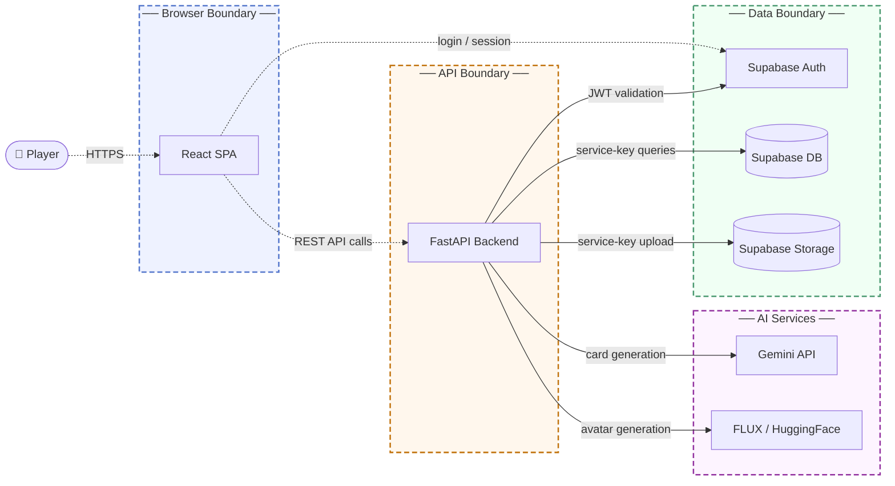

# Threat Model: Nine Lives

## 1. Overview

Nine Lives is a cat-themed roguelike web game in which players upload real photographs of their cats. A multi-stage ML pipeline digitizes each photo into a game card (breed classification, color extraction, AI stat and lore generation, pixel-art avatar generation), and the resulting cat character fights turn-based battles against procedurally generated enemies. When a cat exhausts all nine lives it is memorialized with the player's personal note.

Main components:
- React/TypeScript SPA: game UI, authentication via Supabase JS SDK
- FastAPI backend: ML pipeline orchestration, battle resolution, data management
- ML pipeline services: local ViT breed classifier, YOLO+KMeans color extraction, Google Gemini API (card stats and lore), FLUX.1-schnell via HuggingFace/fal.ai (avatar image generation)
- Supabase platform: Auth (JWT issuance and validation), PostgreSQL database with RLS policies, and public object Storage (cat-images bucket)

This model covers the web application attack surface from unauthenticated public callers through the authenticated API layer to the AI and data tiers.

## 2. Trust Boundaries

- The React SPA trusts Supabase Auth for session token issuance and refresh. Enforcement: the Supabase JS SDK manages token storage and passes JWTs from the active session into every authenticated API call; the anon key embedded in the client is public by design.
- The FastAPI backend trusts callers to present valid Supabase JWTs on protected endpoints. Enforcement: the `get_current_user` dependency validates each token via `supabase.auth.get_user()` on the battle and data routers; the digitize router explicitly carries no authentication requirement and accepts `user_id` as a caller-supplied form field.
- The backend trusts Google Gemini and FLUX/HuggingFace to return schema-conformant outputs. Enforcement: numeric stat bounds in the Gemini response are validated before persistence; free-text fields (lore, ability descriptions) and FLUX image content are accepted without structural verification.
- The Supabase database and storage trust the backend as the authoritative writer. Enforcement: the backend uses the service-role key for all database and storage operations, which fully bypasses RLS; RLS policies exist as a declared backstop but are never exercised on any backend request; ownership is enforced only within each API handler.

## 3. Threat Scenarios

**Unauthenticated game-data creation under arbitrary user accounts**
The digitize endpoint accepts no authentication token and takes `user_id` as a caller-supplied form field. Any unauthenticated caller can create cat records and consume an active game-run slot in any user's account by supplying that user's ID. The same request simultaneously triggers the full ML pipeline, exhausting third-party API quotas (Gemini, FLUX) and inflating storage costs at zero cost to the attacker.
- Risk: High likelihood, High impact
- Mitigation: Require a valid authentication token on the digitize endpoint and derive the user identity exclusively from the verified token, never from the request body.
- Validation: Pentest: submit a digitize request with no Authorization header and with a foreign user_id value; confirm the server returns 401 and creates no database or storage records.

**Prompt injection leading to game-integrity compromise and stored content manipulation**
The `cat_name` and `personality` fields are interpolated directly into the Gemini prompt as free text with no structural separation from the system instructions. An attacker can craft these values to override stat-range constraints, ability-structure rules, or lore content, causing the model to emit out-of-spec card data or embed attacker-controlled text in stored free-text fields that are later rendered to other users. Because the digitize endpoint is unauthenticated, no account is required to attempt this.
- Risk: High likelihood, Medium impact
- Mitigation: Structurally isolate user-supplied text from system-instruction portions of AI prompts and enforce output validation that covers all free-text fields before any AI-generated content is persisted.
- Validation: Code review: confirm that cat_name and personality values containing instruction-override text are safely contained, and that stored lore and description fields are sanitized before rendering in the frontend.

**Retained API access after credential change or session revocation**
Session tokens issued by Supabase are validated by the backend for their full validity window with no check for whether the issuing account has undergone a credential change or explicit sign-out since the token was created. An attacker who obtains a valid token retains full access to all protected endpoints for the token's remaining lifetime, regardless of actions the account owner takes to secure their account.
- Risk: Medium likelihood, High impact
- Mitigation: Integrate with Supabase's server-side session revocation so that password resets and explicit sign-outs immediately invalidate all outstanding tokens before their natural expiry.
- Validation: Automated test: capture an active access token, trigger a credential reset for that account, then confirm that subsequent API calls using the old token are rejected with 401.

**Cross-user data access through application-layer ownership bypass**
All backend database operations use the service-role key, which bypasses Supabase RLS in its entirety. Ownership of cats, game runs, and notes is enforced solely within each individual API handler. A flaw or missing check in any handler means an attacker authenticated with their own valid token can read, modify, or submit battle actions against records belonging to any other user, with no database-level control as a backstop.
- Risk: Medium likelihood, High impact
- Mitigation: Apply ownership filters as a mandatory, audited layer in every handler that touches user-scoped records, and introduce integration tests that use two separate accounts to confirm cross-user access is consistently rejected.
- Validation: Pentest: as a signed-in user, attempt to read memorial cats, update personal notes, and submit battle actions using run IDs and cat IDs that belong to a separate test account; confirm all such requests return 403.

## 4. Architectural Fragilities

**Service-role key as the sole data-access credential with no secondary enforcement layer.** The backend instantiates a single Supabase client using the service-role key for every database and storage operation across all routers. RLS is acknowledged in code comments as a "defense-in-depth backstop" but is never exercised on any backend request because the service key unconditionally bypasses it. This means that ownership enforcement exists in exactly one place per handler: the application-layer query filter. Any handler that omits or misconstructs that filter exposes cross-user data with no secondary control to catch or limit the blast radius. The architectural risk is not any individual filter but the absence of a parallel enforcement layer that would remain effective even when the application layer fails.